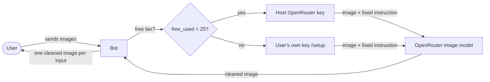

# Mr Prompter — batch watermark / overlay removal bot

A functional Telegram bot. Send it a batch of images and it returns the same
images with watermarks, logos, text overlays, captions and labels removed —
each image processed independently. No prompt or instructions required.



## How it works

1. A user sends one or more images (as photos, or as files for best quality).
2. Each image is processed independently and the cleaned version is sent back —
   so a batch of N images yields N cleaned images.
3. The first **25 images per user** are processed on the host's shared
   OpenRouter key (`HOST_OPENROUTER_KEY`). After that, the user runs `/setup`
   to add their own OpenRouter key and continues with no limit.

A single fixed instruction drives every call (see `REMOVAL_INSTRUCTION` in
`src/engine.py`); the user never writes a prompt. Any image caption is ignored.

## Why an image-output model

Removing a watermark means *returning a new, edited image* — not describing one.
A plain text/vision LLM can only read an image, so this bot uses OpenRouter
**image-output (editing) models**. The curated shortlist defaults to Google's
`gemini-2.5-flash-image` ("nano-banana"). Only image-output models belong in
`MODEL_SHORTLIST`; a text model will fail to return an image.

## Free tier

- Counted **per user, for the lifetime of their record** (`free_used` column).
- A slot is reserved atomically *before* processing (`claim_free_slot`), so a
  batch processed concurrently can never exceed the cap.
- If an image fails, the slot is **refunded** (`release_free_slot`) — failures
  don't cost the user.
- If `HOST_OPENROUTER_KEY` is unset, the free tier is disabled and users must
  add their own key first.

## Commands

| Command   | What it does                                   |
|-----------|------------------------------------------------|
| `/start`  | What the bot does                              |
| `/status` | Free images remaining / current model          |
| `/setup`  | Add your own OpenRouter key, then pick a model |
| `/model`  | Change the AI model                            |
| `/forget` | Delete your stored key, model, and usage count |
| `/cancel` | Cancel the current operation                   |

## Security

- User API keys are **Fernet-encrypted at rest**. The master key lives in
  `data/secret.key` (mode 0400), separate from `.env`, and the SQLite file is
  restricted to `0600`.
- Pasted keys are deleted from the chat on a best-effort basis, and logs redact
  anything matching an OpenRouter/OpenAI key pattern.

## Quick start

```bash
python3 -m venv .venv
source .venv/bin/activate
pip install -r requirements.txt
cp .env.example .env
# fill in TELEGRAM_BOT_TOKEN, ENCRYPTION_KEY, and HOST_OPENROUTER_KEY
python -m src.main
```

Set the bot's commands and disable group privacy as needed via BotFather.

## Stack

- Python 3.12+, `python-telegram-bot` 21
- `httpx` for the OpenRouter image-edit calls
- `aiosqlite` for async SQLite, `cryptography` (Fernet) for key encryption
- Default model: `google/gemini-2.5-flash-image` (overridable via env)

## Tests

```bash
source .venv/bin/activate
pip install -r requirements-dev.txt
pytest
```

Covers the database layer (including a concurrency regression proving the free
tier can't be over-granted), the OpenRouter engine (success, missing-image, HTTP
and network errors), config parsing, and the handler routing (free-tier
exhaustion, own-key unlimited, failure refund, no-host-key).

