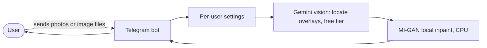

# Mr Prompter — Telegram image cleanup bot

Mr Prompter is a Telegram bot for Gemini-backed image cleanup. It accepts image
messages and returns processed versions with post-added overlays such as logos,
captions, labels, and similar visual elements reduced or removed when possible.

The product is the Telegram bot. The bot is now Gemini-only.

**Note on cost:** Google removed the free tier for all Gemini image-generation
models (including `gemini-2.5-flash-image`) in early 2026 — image editing now
requires a billed project. Gemini's vision/text input is still free, so the
default pipeline is a zero-spend hybrid instead: a free Gemini vision call
locates overlays, and a local CPU model (MI-GAN, ONNX) paints them out. See
[Overlay removal pipeline](#overlay-removal-pipeline) below. The old
single-call paid path (`remove_overlays_gemini_paid` in `src/gemini_engine.py`)
is kept in the code as a manual fallback but is not used by default.

## Current architecture


```mermaid
flowchart LR
    U([User]) -- sends photos or image files --> T[Telegram bot]
    T --> S[Per-user settings]
    S --> GV[Gemini vision: locate overlays, free tier]
    GV --> MI[MI-GAN local inpaint, CPU]
    MI --> T
    T --> U
```

## How it works

1. A user sends one image or a batch of images in Telegram.
2. The bot downloads each image, asks Gemini (free vision call) where the overlays are, then removes them locally with MI-GAN.
3. Single images are returned immediately; Telegram albums are buffered briefly and sent back as grouped results.
4. Users can tune prompt, output format, and rescaling preferences through `/settings`.

## Overlay removal pipeline

Overlay/watermark removal runs in two steps, both free of Gemini image-generation
spend:

1. **Detect** (`src/overlay_detect.py`): a free-tier Gemini vision call
   (`gemini-2.5-flash` by default, override with `GEMINI_VISION_MODEL`) returns
   bounding boxes for detected overlays. The user's custom prompt (if set via
   `/settings`) is passed through as extra guidance to the detector.
2. **Inpaint** (`src/local_inpaint.py`): a local MI-GAN ONNX model (CPU) fills
   in the detected regions. Pixels outside the (padded) detected regions are
   left byte-identical to the original — only the overlay areas are touched.

Fetch the MI-GAN weights (~27 MB) with:

```bash
./scripts/download_migan_model.sh
```

The model path can be overridden with `MIGAN_MODEL_PATH` (default
`models/migan_pipeline_v2.onnx`). If nothing is detected, or the local model
isn't downloaded, the bot reports a clear error rather than silently falling
back to a paid Gemini call. Inference is serialized to one image at a time and
crops are capped at 768px on the long edge before inference — both tuned to
stay within the small-VPS memory budget (verified empirically: MI-GAN's own
peak footprint is ~470 MB RSS on a 2 vCPU / ~1.9 GB RAM box).

## Commands

| Command | What it does |
|---|---|
| `/settings` | Show and change prompt, output format, and rescaling settings |
| `/speak` | Generate a voice/audio message from text (or by replying to a message) |
| `/cancel` | Cancel any pending text input or active action |
| `/support` | Report an issue or feedback to the support team |
| `/forget` | Delete the user's stored data |
| `/push_the_horses` | Run the gamified dice-roll command |


## Settings

The settings surface is centered on `/settings`, with inline choices for output
format and upscaling. Choosing the prompt option switches the bot into a short
text-entry follow-up so the next text message becomes the custom prompt.

Settings currently include:

- Prompt: default, custom prompt, or reset to default.
- Output format: zip with images, images as files, or images inline.
- Upscaling / rescaling: none, or auto full HD.

Auto full HD runs after Gemini cleaning as deterministic local post-processing:
below-Full-HD images are upscaled with aspect ratio preserved, while images that
are already Full HD or larger are left unchanged.

Upscaling uses a compact Real-ESRGAN super-resolution model (ONNX, CPU-only)
when its weights are present, and falls back to plain Lanczos resizing
otherwise. Fetch the weights (~5 MB) with:

```bash
./scripts/download_sr_model.sh
```

The model path can be overridden with `SR_MODEL_PATH` (default
`models/realesr-general-x4v3.onnx`). SR inference is serialized to one image
at a time to stay within small-VPS memory limits.

## Security

- The bot stores per-user settings in SQLite.
- The SQLite database is restricted to `0600`.
- Logs redact API-key-like strings on a best-effort basis.

## Quick start

### Telegram bot (primary)

```bash
python3 -m venv .venv
source .venv/bin/activate
pip install -r requirements.txt
cp .env.example .env
```

Set at minimum:

- `TELEGRAM_BOT_TOKEN`
- `GEMINI_API_KEY` for the Gemini-backed bot flow

Then start the bot:

```bash
chmod +x run_bot.sh
./run_bot.sh
```

What `run_bot.sh` does:

- Activates `.venv` or `venv` if present
- Loads `.env`
- Starts the Telegram bot (`python -m src.main`)

### Standalone Gemini CLI utility

This repo also includes a one-shot Gemini image cleanup script. It is a utility
for batch processing outside Telegram, not the main product surface.

```bash
python scripts/gemini_25_free_watermark_remover.py /path/to/images/
python scripts/gemini_25_free_watermark_remover.py photo.jpg folder/ --prompt-file prompts/conservative-watermark-removal.txt
```

You can also run it through the wrapper script:

```bash
./run_bot.sh --gemini /path/to/images/
```

### Upscaling evaluation harness

For visual comparison of upscaling settings, run the offline-first harness over
one or more image files or folders. Local-only runs do not call Gemini.

```bash
pip install pillow
python scripts/evaluate_upscaling_quality.py /path/to/images/ --factors 2,3,4 --resamplers lanczos,bicubic
```

Outputs are written under `data/upscaling-evals/<timestamp>/outputs/` with a
`manifest.json` describing every generated or skipped strategy.

Gemini repair/finish strategies are opt-in and require both a flag and an API
key:

```bash
GEMINI_API_KEY=... python scripts/evaluate_upscaling_quality.py /path/to/images/ --enable-gemini
```

## Production

### Systemd

1. Copy the example service file:

   ```bash
   sudo cp deploy/mr-prompter-bot.service /etc/systemd/system/
   ```

2. Edit it for your machine, especially `User` and `WorkingDirectory`.

3. Reload and start:

   ```bash
   sudo systemctl daemon-reload
   sudo systemctl enable mr-prompter-bot
   sudo systemctl start mr-prompter-bot
   ```

4. Useful commands:

   ```bash
   sudo systemctl status mr-prompter-bot
   sudo journalctl -u mr-prompter-bot -f
   sudo systemctl restart mr-prompter-bot
   ```

The service file currently starts the Telegram bot via `run_bot.sh`.

## Logs

Uncaught errors are logged to disk for post-mortem analysis:

- Telegram bot: `data/logs/errors.log`
- Standalone Gemini CLI utility: `data/logs/gemini_free_errors.log`

Both use rotating log files.

## Stack

- Python 3.12+
- `python-telegram-bot` 21
- `google-genai` for Gemini vision (overlay detection) and voice (`/speak`)
- `onnxruntime` for local MI-GAN inpainting and Real-ESRGAN upscaling (CPU)
- `aiosqlite` for async SQLite
- `Pillow` for deterministic local image resizing

## Tests

```bash
source .venv/bin/activate
pip install -r requirements-dev.txt
pytest
```

Heavy model tests are opt-in on small machines. The default suite skips the
Real-ESRGAN path unless you set `RUN_SR_MODEL_TESTS=1`, and skips the MI-GAN
inpainting path unless you set `RUN_MIGAN_MODEL_TESTS=1` (after running
`./scripts/download_migan_model.sh`).

Current tests cover:

- Gemini engine behavior (overlay detection + local inpaint orchestration, and
  the old paid single-call path kept as a fallback)
- overlay detection (`src/overlay_detect.py`) and local inpainting
  (`src/local_inpaint.py`)
- database behavior for prompt storage
- standalone Gemini CLI utility behavior
- startup wiring in `src.main`
- handler behavior for the current Gemini-plus-settings bot flow, including
  `push_the_horses`
